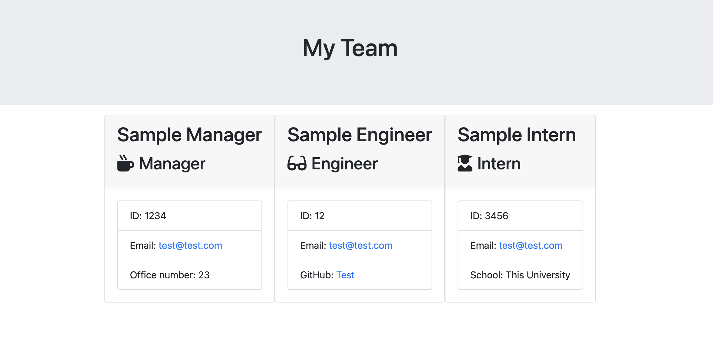

# Employee Team Generator 

## Description
This command-line app allows users to create a basic HTML file that will display the team members they add. The user is prompted to add team members, and enter information about each employee. When the questions are answered and the page is rendered, the new HTML file will be created in the "Output" folder. You can view a sample HTML page in the "assets" folder.

## Installation
Clone the repository from GitHub, then install the node modules (jest and inquirer).

## Usage
To use this app, simply run the "index.js" file, and answer the questions as prompted. You can add as many team members as you'd like, then simply select "Finish building team" to render the page and get the HTML file. 

